

  <picture></picture>

  <picture></picture>

 
 

> **Chewing and tearing through bugs, growing while having fun.** Welcome to the Bulldog's House! 🐶  
> **버그 씹고 뜯으며 놀면서 성장 중인 불독의 집에 오신것을 환영합니다**

## Contact

<table>
<tr>
<td valign="middle" align="right" width="160"><b>Email</b></td>
<td valign="middle">
houndscorporation<!-- -->@<!-- -->gmail.com
</td>
</tr>
<tr>
<td valign="middle" align="right"><b>Connect</b></td>
<td valign="middle">
&#8194;&#8194;
</td>
</tr>
</table>

## Tech Stack

<table>
<tr>
<td valign="middle" align="right" width="160"><b>Languages</b></td>
<td valign="middle">
<picture>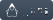</picture>
<picture>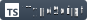</picture>
<picture></picture>
<picture>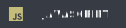</picture>
<picture></picture>
<picture></picture>
<picture></picture>
<picture>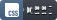</picture>
</td>
</tr>
<tr>
<td valign="middle" align="right"><b>Frontend</b></td>
<td valign="middle">
<picture>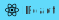</picture>
<picture></picture>
<picture>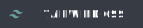</picture>
<picture></picture>
<picture>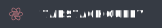</picture>
<picture></picture>
<picture></picture>
<picture></picture>
<picture></picture>
<picture>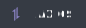</picture>
<picture></picture>
<picture></picture>
</td>
</tr>
<tr>
<td valign="middle" align="right"><b>Backend</b></td>
<td valign="middle">
<picture>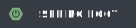</picture>
<picture></picture>
<picture>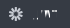</picture>
<picture></picture>
<picture></picture>
<picture></picture>
<picture></picture>
<picture></picture>
<picture></picture>
</td>
</tr>
<tr>
<td valign="middle" align="right"><b>Database</b></td>
<td valign="middle">
<picture></picture>
<picture></picture>
<picture></picture>
</td>
</tr>
<tr>
<td valign="middle" align="right"><b>DevOps</b></td>
<td valign="middle">
<picture>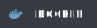</picture>
<picture></picture>
<picture></picture>
<picture></picture>
</td>
</tr>
<tr>
<td valign="middle" align="right"><b>Data Science</b></td>
<td valign="middle">
<picture></picture>
<picture>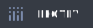</picture>
<picture>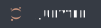</picture>
</td>
</tr>
<tr>
<td valign="middle" align="right"><b>Tools & Testing</b></td>
<td valign="middle">
<picture></picture>
<picture></picture>
<picture></picture>
<picture></picture>
<picture></picture>
<picture></picture>
<picture></picture>
<picture></picture>
</td>
</tr>
<tr>
<td valign="middle" align="right"><b>AI</b></td>
<td valign="middle">
<picture>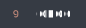</picture>
<picture></picture>
<picture>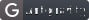</picture>
<picture></picture>
<picture></picture>
<picture></picture>
</td>
</tr>
</table>
